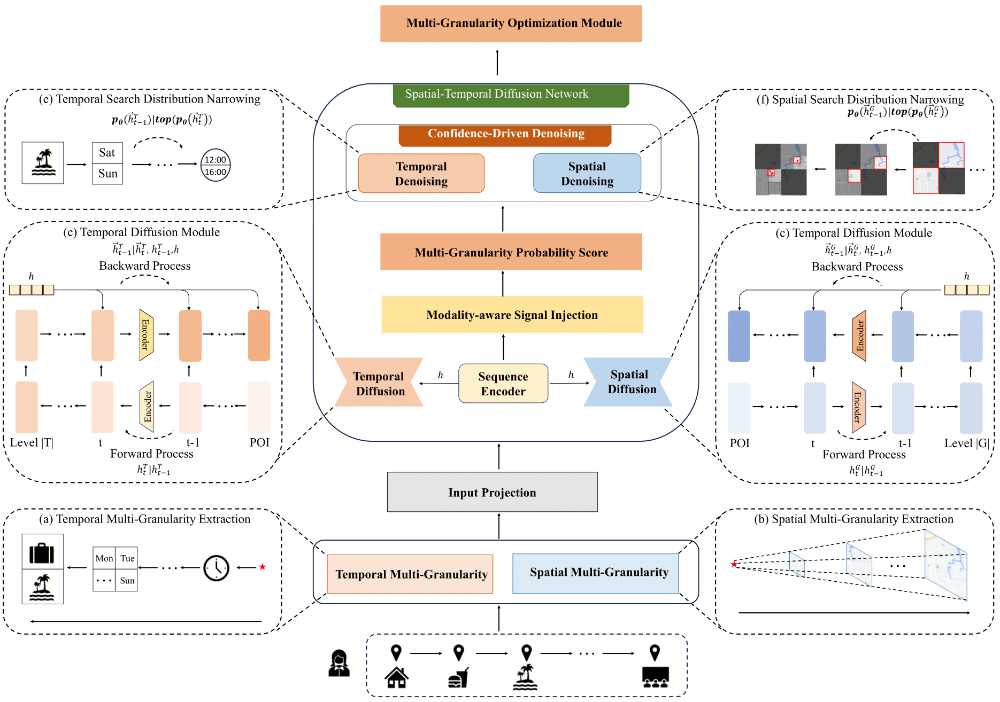
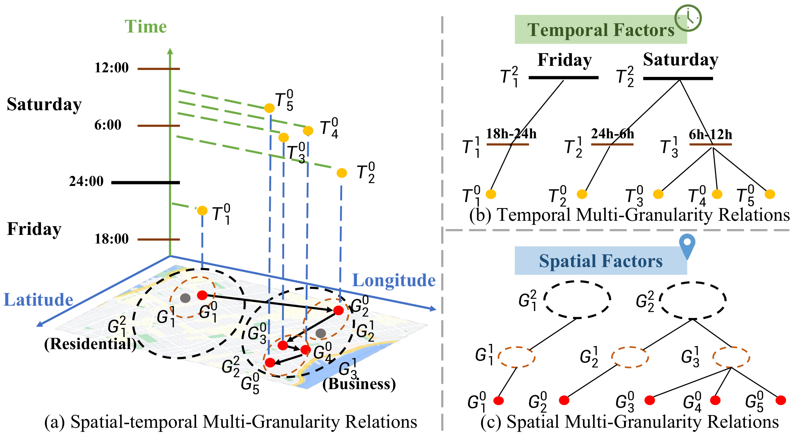
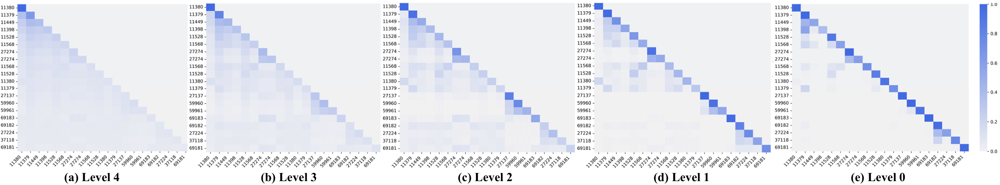

# MGSTDN: Multi-Granularity Spatial-Temporal Diffusion Network for Next POI Recommendation

# Requirements
```
pip install -r requirements.txt
```

# Data Preparation

**1. place [flashback_data.zip](https://drive.google.com/file/d/1QXdpp0_QesJo7NZdhvoafg4MlpI_Bx-O/view?usp=sharing) into /data/ and unzip the file as following:**

/data/checkins-gowalla.txt

/data/checkins-4sq.txt

<!-- https://drive.google.com/file/d/1ST6GQidWVlR6yQle38MfPUSUc29t9xIT/view?usp=sharing -->

**2. place [Graphs.zip](https://drive.google.com/file/d/1KC361Gq-K-0Aw7xu5pyl51YOgMK9JtMb/view?usp=sharing) into KGE/ and unzip the file as following :**

/KGE/gowalla_scheme2_transe_loc_temporal_100.pkl

# Model Training

```
python train.py
```

# Motivation
Existing methods often fall short in capturing the comprehensive multi-granularity spatial-temporal correlations due to three primary limitations: (1) users’ complex mobility patterns entangled in multi-granularity spatial-temporal data, (2) limited mobility patterns details due to independent modeling at each granularity, and (3) low inference efficiency in cascaded multi-granularity predictions. 


# Cross-Granularity Visualization
We visualized the context similarity weight matrix of the trajectory sequence for user ID 2064 to provide further evidence that learning factual cross-granularity relationships improves prediction results. We observed that fine-grained attention shares a similar attention distribution with coarser-grained attention, verifying that fine-grained movement patterns rely on coarse-grained ones.
